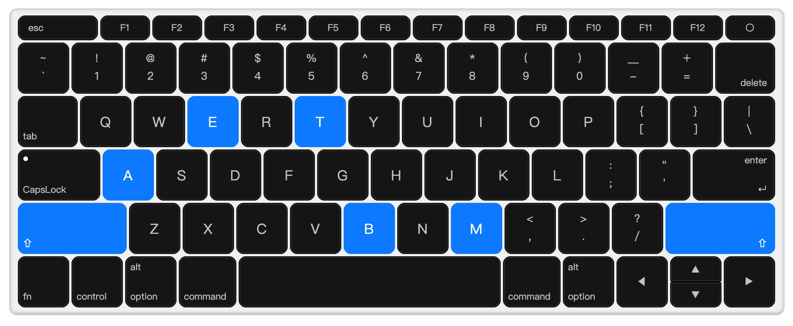

# Macbook Keyboard

A tiny library to display a reactive macbook keyboard on screen.



## Feature

- vanilla, no framework required
- no dependency
- dark/light theme
- i18n friendly

## Usage

```javascript
// create an instance by invoking the factory method
const kbd = MacbookKeyboard({ theme: 'dark' });
// toggle the pressed status of key 'Shift'
kbd.toggle('Shift');
// get the pressed status of key 'Shift'
kbd.check('Shift');
// reset pressed status for all keys
kbd.clear();
```

## Options

```json
{
  // "dark", "light"
  "theme": "dark",
  // display label on each key
  "showLabel": true,
  // map key settings
  "keyMappings": {
    "Enter": {
      "label": ["enter", "回车"],
    },
  },
}
```

## Thanks

This project is inspired by [react-mac-keyboard](https://github.com/uiwjs/react-mac-keyboard).

## License

MIT
